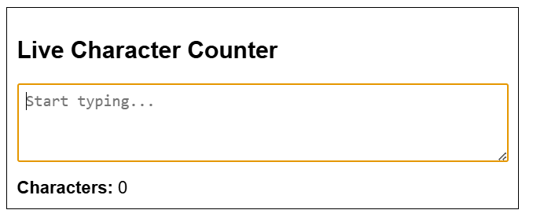
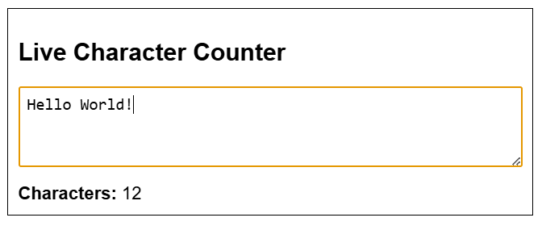

# 📝 Live Character Counter for Text Area

## 🎯 Objective

Create a simple feature that displays a **live character count** as the user types in a `<textarea>`. This task helps you practice **real-time event handling** and **dynamic content updates** to improve user interaction and feedback.


## 📋 Task Description

Build a web page that includes:

- A **textarea** where the user can input text.
- A **live character counter** displayed below or beside the textarea.

### ✅ Functionality Requirements

- The counter should:
  - Update **immediately** as the user types or deletes content.
  - Show the **current number of characters** entered.
  - Provide **clear and instant feedback**.

> This task focuses on DOM manipulation using JavaScript and reinforces user-centric UI behavior.

### Code – HTML5 [View Code](main.html)
```html
<!DOCTYPE html>
<html lang="en">
<head>
    <meta charset="UTF-8">
    <meta name="viewport" content="width=device-width, initial-scale=1.0">
    <title>Live Character Counter</title>
    <link rel="stylesheet" href="style.css">
</head>
<body>
    <div class="container">
        <h2>Live Character Counter</h2>
        <textarea id="textinput" placeholder="Start typing..."></textarea>
        <div class="counter">
            <b>Characters:</b> <span id="charCount">0</span>
        </div>
    </div>
    <script src="script.js"></script>
</body>
</html>
```
### Code – CSS [View Code](style.css)
```
.container {
    border: 1px solid black;
    padding: 10px;
    font-family: Arial, Helvetica, sans-serif;
    max-width: 500px;
}

textarea {
    width: 100%;
    height: 80px;
    font-size: 16px;
    padding: 8px;
    box-sizing: border-box;
    margin-bottom: 8px;
}

.counter {
    font-size: 1.1em;
    margin-top: 4px;
}

.counter b {
    font-weight: bold;
}
```

### Code – JavaScript [View Code](script.js)
```javascript
const textarea = document.getElementById('textinput');
const counter = document.getElementById('charCount');

textarea.addEventListener('input', () => {
    counter.textContent = textarea.value.length;
});
```
## 📸 Screenshot - Output



## Learning Outcome
- Gain experience with real-time **DOM event handling**.
- Practice **updating UI dynamically** with JavaScript.
- Improve **user interaction feedback** using simple logic.
